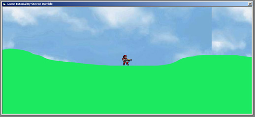



## A Simple Side Platform Engine

### Description

This tutorial and example will go through the basics of how to create a 2d side platform game engine. It covers bitblt, collision detection, keyboard input and a simple physics engine. It can easily be modified to suit many different side scroller variations.

This is my first submission and first tutorial any feedback would be greatly appreciated. Please forgive any spelling or grammatical errors. Thank You.
 
### More Info
 

             |
---                |---
**Submitted On**   |2003-01-15 15:05:12
**By**             |[Steven Dumble](https://github.com/Planet-Source-Code/PSCIndex/blob/master/ByAuthor/steven-dumble.md)
**Level**          |Beginner
**User Rating**    |4.4 (35 globes from 8 users)
**Compatibility**  |VB 5\.0, VB 6\.0
**Category**       |[Games](https://github.com/Planet-Source-Code/PSCIndex/blob/master/ByCategory/games__1-38.md)
**World**          |[Visual Basic](https://github.com/Planet-Source-Code/PSCIndex/blob/master/ByWorld/visual-basic.md)
**Archive File**   |[A\_Simple\_S1530221172003\.zip](https://github.com/Planet-Source-Code/steven-dumble-a-simple-side-platform-engine__1-42489/archive/master.zip)

